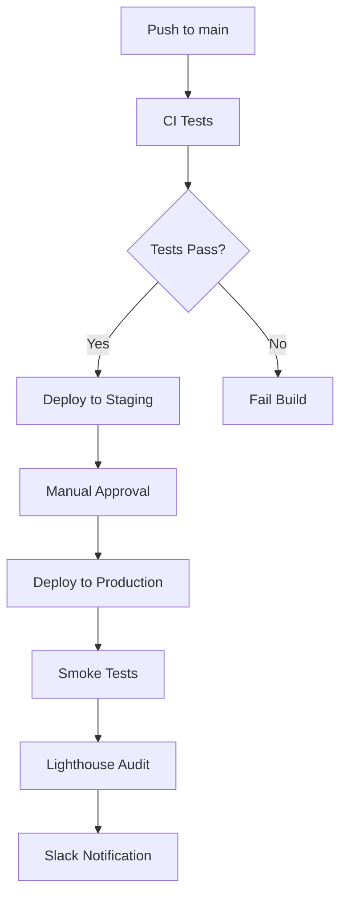

# CI/CD Setup Guide

このドキュメントでは、GitHub Actions CI/CDパイプラインの設定方法を説明します。

## 🔧 GitHub Environments の設定

### 1. Staging Environment
GitHub リポジトリの Settings > Environments で `staging` 環境を作成します。

### 2. Production Environment
同様に `production` 環境を作成し、以下の保護ルールを設定します：
- **Required reviewers**: 1人以上のレビュアーが必要
- **Wait timer**: 5分間の待機時間
- **Deployment branches**: `main` ブランチのみ許可

## 🔐 GitHub Secrets の設定

以下のシークレットを GitHub リポジトリの Settings > Secrets and variables > Actions で設定してください：

### 必須シークレット

#### Vercel デプロイ用
```
VERCEL_TOKEN=your_vercel_token_here
VERCEL_ORG_ID=your_vercel_org_id
VERCEL_PROJECT_ID=your_vercel_project_id
```

#### Code Coverage 用
```
CODECOV_TOKEN=your_codecov_token_here
```

#### Slack 通知用（オプション）
```
SLACK_WEBHOOK=your_slack_webhook_url
```

## 📦 Vercel設定の取得方法

### 1. Vercel Token の取得
1. [Vercel Dashboard](https://vercel.com/dashboard) にログイン
2. Settings > Tokens で新しいトークンを作成
3. 作成したトークンを `VERCEL_TOKEN` として設定

### 2. Organization ID の取得
```bash
npx vercel whoami
```

### 3. Project ID の取得
```bash
npx vercel link
# プロジェクトをリンクした後
cat .vercel/project.json
```

## 🔄 ワークフローの概要

### CI ワークフロー (`ci.yml`)
- **トリガー**: PRとmainブランチへのpush
- **実行内容**:
  - 複数Nodeバージョンでのテスト
  - TypeScript型チェック
  - ESLint実行
  - 単体テスト（カバレッジ付き）
  - E2Eテスト（Playwright）
  - セキュリティ監査
  - CodeQL分析

### CD ワークフロー (`cd.yml`)
- **トリガー**: mainブランチへのpush
- **実行内容**:
  - Staging環境へのデプロイ
  - Production環境へのデプロイ（手動承認付き）
  - 本番環境でのスモークテスト
  - Lighthouse性能測定
  - Slack通知

### 依存関係更新ワークフロー (`dependency-update.yml`)
- **トリガー**: 毎週月曜日 9:00 UTC
- **実行内容**:
  - npm依存関係の更新
  - セキュリティ脆弱性の修正
  - テスト実行
  - 自動PRの作成

## 📊 成果物とレポート

### アップロードされる成果物
- **Build files**: ビルドされたアプリケーション
- **Playwright reports**: E2Eテストの結果
- **Coverage reports**: コードカバレッジレポート
- **Lighthouse reports**: 性能測定結果

### 外部サービス連携
- **Codecov**: コードカバレッジの可視化
- **Slack**: デプロイ通知
- **Vercel**: アプリケーションのホスティング

## 🚀 デプロイフロー



## 🔍 監視とアラート

### ビルド失敗時の対応
1. GitHub Actions のログを確認
2. 失敗した段階を特定
3. 必要に応じてロールバック
4. 修正後に再デプロイ

### 性能監視
- Lighthouse CI によるCore Web Vitals の監視
- 設定したbudgetを超えた場合のアラート
- 継続的な性能改善の提案

## 🛠 トラブルシューティング

### よくある問題

#### 1. Vercelデプロイが失敗する
```
Error: Project not found
```
**解決方法**: `VERCEL_PROJECT_ID` が正しく設定されているか確認

#### 2. テストが失敗する
```
Error: Cannot find module
```
**解決方法**: `npm ci` でクリーンインストールを実行

#### 3. Playwright E2Eテストが失敗する
```
Error: Browser not found
```
**解決方法**: `npx playwright install --with-deps` を実行

## 📝 ベストプラクティス

### 1. シークレット管理
- 最小権限の原則を適用
- 定期的なトークンの更新
- 環境ごとの適切な分離

### 2. テスト戦略
- 単体テストで基本機能をカバー
- E2Eテストで重要なユーザーフローをカバー
- 性能テストで品質を保証

### 3. デプロイメント
- ステージング環境での十分な検証
- 本番環境での段階的ロールアウト
- 障害時の迅速なロールバック

## 🔄 継続的改善

### 定期的な見直し項目
- [ ] ワークフローの実行時間最適化
- [ ] テストカバレッジの向上
- [ ] セキュリティ設定の見直し
- [ ] パフォーマンス基準の更新

### メトリクス監視
- ビルド時間
- テスト実行時間
- デプロイ頻度
- 失敗率

このCI/CDパイプラインにより、高品質なアプリケーションの継続的な開発とデプロイが可能になります。